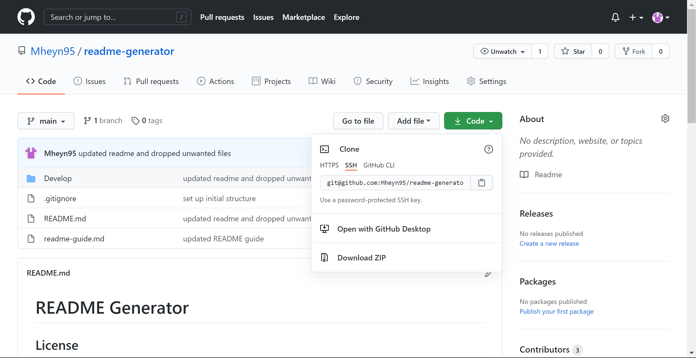
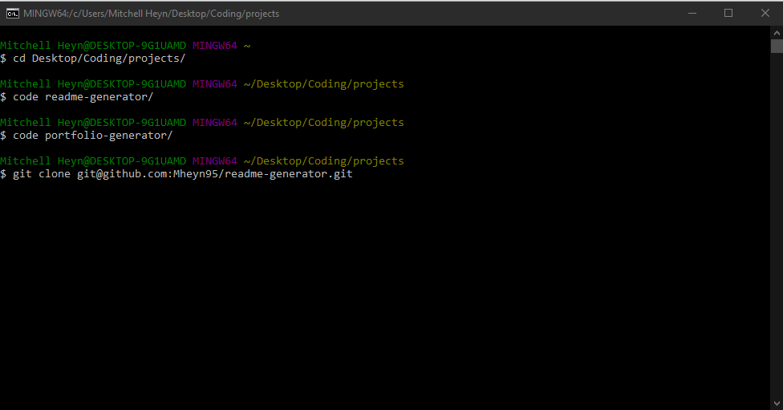
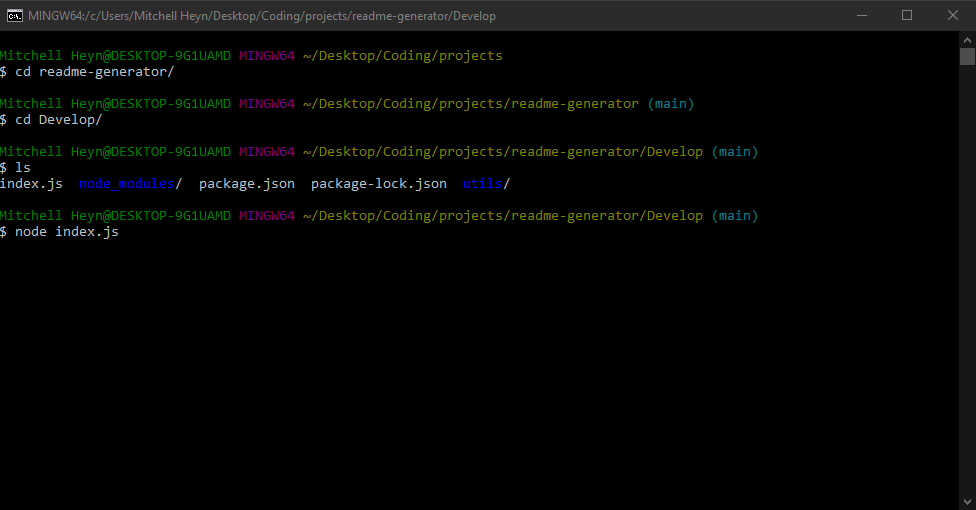

# README Generator

## License

## Description

This application can be used to generate a professional README.md file through the command line. The command line will prompt you for some key information and once that is complete a README file will automaticall be generated based on the information provided.

## Table of Contents

- [Installation](#installation)
- [Usage](#usage)
- [Test](#test)
- [Questions](#questions)
- [License](#license)
- [Credits](#credits)

## Installation

To install this file navigate to [https://github.com/Mheyn95/readme-generator](https://github.com/Mheyn95/readme-generator) in a web browser and clone the repository.

Here is an image of GitHub and where you can go to clone the repo.

Here is an image of the command you run in terminal to clone the repo onto your own local machine

## Usage

To use this application go to the directory where you cloned the repository. From here change directories to "Develop". Once here you can run "node index.js", the application will then run and prompt you for information.

Here you can see the different commands to run to navigate into the parent directory, and then in to the "Develop" directory. Once in there you can run the application by typing "node index.js"!

## Test

In order to test this application you can run it and just type "test" for all the user prompts (except the one requiring Y/N, just type one or the other for this one). To test the app make sure you answer all questions and then check to make sure a README.md file was created in the same directory as "index.js". Navigate to the README and make sure all the sections are filled in with "test". You can then delete this file and run the application again and submit actual answers to generate a real README.

## Questions

- GitHub - [https://github.com/Mheyn95](https://github.com/Mheyn95)
- Email - [mheyn95@gmail.com](mailto:mheyn95@gmail.com)

## Contributing

Mitchell Heyn
